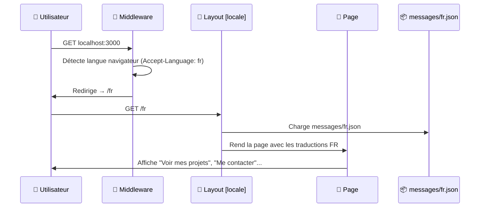
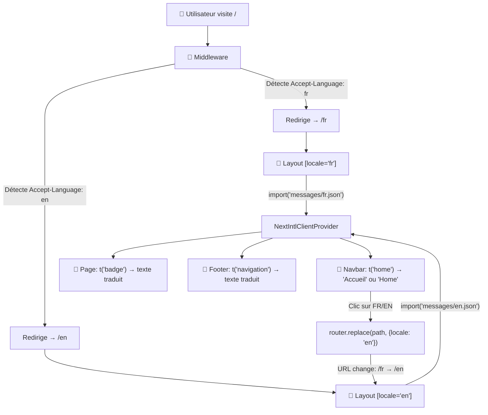

# 🌍 Comment fonctionne next-intl dans ton projet — Étape par étape

## Vue d'ensemble : Le parcours d'une requête

Quand un utilisateur tape `localhost:3000` dans son navigateur, voici **exactement** ce qui se passe, dans l'ordre :



---

## Étape 1 : Les fichiers de traductions (la base de tout)

**Fichiers** : [fr.json](file:///C:/Users/jonas/Music/portefolio/portofolio_kalvin/messages/fr.json) et [en.json](file:///C:/Users/jonas/Music/portefolio/portofolio_kalvin/messages/en.json)

Ce sont de simples fichiers JSON qui contiennent **tous les textes** de ton site, organisés par section :

````carousel
```json
// messages/fr.json
{
  "nav": {
    "home": "Accueil",
    "projects": "Projets",
    "contact": "Contact"
  },
  "hero": {
    "badge": "Disponible pour missions remote",
    "ctaPrimary": "Voir mes projets"
  }
}
```
<!-- slide -->
```json
// messages/en.json
{
  "nav": {
    "home": "Home",
    "projects": "Projects",
    "contact": "Contact"
  },
  "hero": {
    "badge": "Available for remote missions",
    "ctaPrimary": "View my projects"
  }
}
```
````

> [!IMPORTANT]
> Les **clés** (ex: `nav.home`, `hero.badge`) sont identiques dans les deux fichiers. Seules les **valeurs** changent. C'est ce qui permet à `next-intl` de savoir quel texte afficher selon la langue.

---

## Étape 2 : Le Middleware — Le gardien de la porte

**Fichier** : [middleware.ts](file:///C:/Users/jonas/Music/portefolio/portofolio_kalvin/middleware.ts)

```typescript
import createMiddleware from 'next-intl/middleware';
import { routing } from './i18n/routing';

export default createMiddleware(routing);

export const config = {
  matcher: ['/((?!api|_next|.*\\..*).*)']
};
```

**Ce qu'il fait** : Il intercepte **chaque requête** AVANT qu'elle n'atteigne tes pages.

| Scénario | Ce que fait le middleware |
|---|---|
| L'utilisateur tape `/` | Il lit le header `Accept-Language` du navigateur (ex: `fr-FR`) → redirige vers `/fr` |
| L'utilisateur tape `/en/contact` | Il voit que `en` est une locale valide → laisse passer |
| L'utilisateur tape `/es/contact` | `es` n'est pas dans nos locales → redirige vers `/fr/contact` (la locale par défaut) |

Le `matcher` dit au middleware : "Intercepte tout SAUF les routes `/api`, les fichiers statiques (`_next`), et les fichiers avec extension (`.jpg`, `.css`...)."

---

## Étape 3 : La configuration de routing

**Fichier** : [routing.ts](file:///C:/Users/jonas/Music/portefolio/portofolio_kalvin/i18n/routing.ts)

```typescript
import { defineRouting } from 'next-intl/routing';

export const routing = defineRouting({
  locales: ['fr', 'en'],        // Les langues supportées
  defaultLocale: 'fr',           // Français par défaut
  localePrefix: 'always'         // Toujours mettre /fr ou /en dans l'URL
});
```

C'est la **source de vérité** pour tout le système. Tous les autres fichiers importent cette config.

---

## Étape 4 : Le chargement des messages côté serveur

**Fichier** : [request.ts](file:///C:/Users/jonas/Music/portefolio/portofolio_kalvin/i18n/request.ts)

```typescript
export default getRequestConfig(async ({ requestLocale }) => {
  let locale = await requestLocale;

  // Si la locale n'est pas valide, on utilise le français
  if (!locale || !routing.locales.includes(locale as 'fr' | 'en')) {
    locale = routing.defaultLocale;
  }

  return {
    locale,
    messages: (await import(`../messages/${locale}.json`)).default
    //                       ↑ Import dynamique : charge fr.json OU en.json
  };
});
```

**Ce qu'il fait** : À chaque requête serveur, il :
1. Récupère la locale depuis l'URL (ex: `/fr/projets` → `locale = "fr"`)
2. Valide que c'est une locale supportée
3. Charge le bon fichier JSON (`fr.json` ou `en.json`)
4. Renvoie les messages pour les rendre disponibles dans toute l'app

---

## Étape 5 : Le Layout `[locale]` — Le distributeur de traductions

**Fichier** : [layout.tsx](file:///C:/Users/jonas/Music/portefolio/portofolio_kalvin/app/%5Blocale%5D/layout.tsx)

```typescript
export default async function LocaleLayout({ children, params }) {
  const { locale } = await params;  // Récupère "fr" ou "en" depuis l'URL

  const messages = await getMessages(); // Charge fr.json ou en.json

  return (
    <html lang={locale}>
      <body>
        <NextIntlClientProvider messages={messages}>
          {/*    ↑ CE PROVIDER rend les traductions disponibles     */}
          {/*      dans TOUS les composants enfants (Navbar, etc.)  */}
          <Navbar />
          <main>{children}</main>
          <Footer />
        </NextIntlClientProvider>
      </body>
    </html>
  );
}
```

> [!TIP]
> Le segment `[locale]` dans le chemin `app/[locale]/page.tsx` est un **segment dynamique** de Next.js. Quand l'URL est `/fr/projets`, Next.js sait que `locale = "fr"` et `page = projets`.

Le `NextIntlClientProvider` est comme un **tuyau** qui distribue les traductions à tous les composants enfants. Sans lui, aucun `useTranslations()` ne fonctionnerait.

---

## Étape 6 : Utilisation dans les composants — useTranslations()

C'est ici que la magie opère. Dans **chaque composant**, on utilise le hook `useTranslations` :

### Exemple simple (Navbar)

```typescript
// components/layout/Navbar.tsx
import { useTranslations } from 'next-intl';

export default function Navbar() {
  const t = useTranslations('nav');
  //                         ↑ On dit "je veux les traductions de la section 'nav'"

  return (
    <nav>
      <Link href="/">{t('home')}</Link>
      {/*                ↑ Si locale=fr → "Accueil"  */}
      {/*                  Si locale=en → "Home"     */}
      
      <Link href="/projets">{t('projects')}</Link>
      {/*                      ↑ Si locale=fr → "Projets"  */}
      {/*                        Si locale=en → "Projects"  */}
    </nav>
  );
}
```

### Exemple avec texte riche (page d'accueil)

Pour du texte avec des mots en gras au milieu :

```json
// fr.json
"description": "Je conçois des solutions digitales {bold1} et {bold2}..."
```

```tsx
// Dans le composant :
{t.rich('description', {
  bold1: (chunks) => <strong>{chunks}</strong>,
  bold2: (chunks) => <strong>{chunks}</strong>,
})}
// Résultat : "Je conçois des solutions digitales **performantes** et **élégantes**..."
```

`t.rich()` permet d'injecter des **composants React** (comme `<strong>`) à l'intérieur des traductions.

---

## Étape 7 : Le changement de langue — Le bouton FR/EN

**Fichier** : [Navbar.tsx](file:///C:/Users/jonas/Music/portefolio/portofolio_kalvin/components/layout/Navbar.tsx) (lignes 39-42)

```typescript
import { useLocale } from 'next-intl';
import { useRouter, usePathname } from '@/i18n/navigation';

const locale = useLocale();           // "fr" ou "en"
const router = useRouter();           // Router locale-aware
const intlPathname = usePathname();   // Ex: "/projets" (sans le préfixe /fr)

const toggleLanguage = () => {
  const nextLocale = locale === 'fr' ? 'en' : 'fr';
  router.replace(intlPathname, { locale: nextLocale });
  // ↑ Si on est sur /fr/projets → navigue vers /en/projets
  //   Sans recharger la page ! Transition instantanée.
};
```

> [!NOTE]
> `usePathname()` de `@/i18n/navigation` retourne le chemin **sans** le préfixe de locale. Donc si l'URL est `/fr/projets`, il retourne juste `/projets`. Cela permet de simplement "remplacer" la locale tout en restant sur la même page.

---

## Étape 8 : Les liens locale-aware

**Fichier** : [navigation.ts](file:///C:/Users/jonas/Music/portefolio/portofolio_kalvin/i18n/navigation.ts)

```typescript
import { createNavigation } from 'next-intl/navigation';
import { routing } from './routing';

export const { Link, redirect, usePathname, useRouter } = createNavigation(routing);
```

Ce fichier crée des **versions améliorées** des outils de navigation Next.js :

| Outil standard | Outil next-intl | Différence |
|---|---|---|
| `<Link href="/projets">` | `<Link href="/projets">` | Ajoute automatiquement `/fr` ou `/en` devant |
| `useRouter()` | `useRouter()` | Le `push()` et `replace()` acceptent `{ locale }` |
| `usePathname()` | `usePathname()` | Retourne le chemin sans le préfixe de locale |

Donc quand tu écris `<Link href="/contact">` dans la Navbar, le composant Link de `@/i18n/navigation` transforme automatiquement ça en `/fr/contact` ou `/en/contact` selon la langue active.

---

## Résumé visuel du flux complet



---

## En résumé, les 3 concepts clés :

1. **Les messages JSON** = la base de données de tous tes textes dans chaque langue
2. **Le middleware** = le garde qui redirige automatiquement vers la bonne langue
3. **`useTranslations()`** = le hook magique qui, dans n'importe quel composant, retourne le bon texte selon la locale active

C'est tout ! Le reste (routing, navigation, provider) est juste de la "plomberie" qui connecte ces 3 éléments ensemble.
