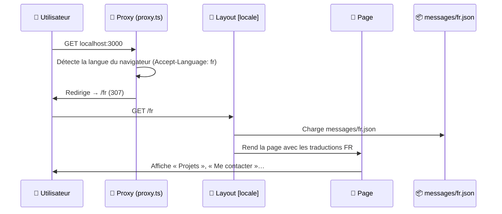
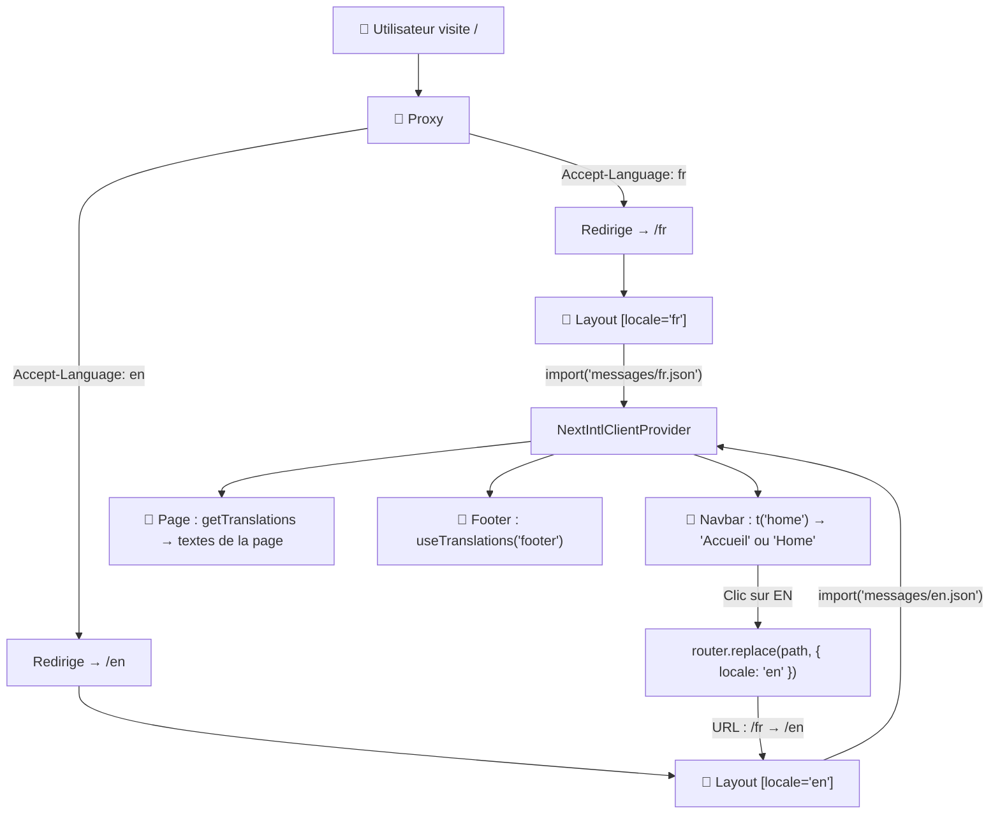

# 🌍 Comment fonctionne next-intl dans ton projet — Étape par étape

> Guide à jour de l'architecture réelle (Next.js 16, next-intl 4). Chaque
> comportement décrit ici a été vérifié sur le build de production.

## Vue d'ensemble : Le parcours d'une requête

Quand un utilisateur tape `localhost:3000` dans son navigateur, voici **exactement** ce qui se passe, dans l'ordre :



> [!NOTE]
> Toutes les pages (`/fr`, `/en`, `/fr/projets`…) sont **pré-rendues au build**
> (génération statique). Le schéma ci-dessus décrit ce que fait Next.js ; en
> production, le HTML de `/fr` est déjà prêt et servi instantanément.

---

## Étape 1 : Les fichiers de traductions (la base de tout)

**Fichiers** : [messages/fr.json](messages/fr.json) et [messages/en.json](messages/en.json)

Ce sont de simples fichiers JSON qui contiennent **tous les textes** de ton site, organisés par section (`nav`, `home`, `projects_data`, `contact_page`…) :

```json
// messages/fr.json
{
  "nav": {
    "home": "Accueil",
    "projects": "Projets",
    "contactBtn": "Me contacter"
  },
  "contact_cta": {
    "title": "Un projet, un poste, une question ?"
  }
}
```

```json
// messages/en.json
{
  "nav": {
    "home": "Home",
    "projects": "Projects",
    "contactBtn": "Contact me"
  },
  "contact_cta": {
    "title": "A project, a position, a question?"
  }
}
```

> [!IMPORTANT]
> Les **clés** (ex : `nav.home`, `contact_cta.title`) sont identiques dans les deux fichiers. Seules les **valeurs** changent. C'est ce qui permet à `next-intl` de savoir quel texte afficher selon la langue.

### Le filet de sécurité : les clés sont vérifiées à la compilation

**Fichier** : [types/i18n.types.ts](types/i18n.types.ts)

- `fr.json` est déclaré comme **forme officielle** des messages (`AppConfig`) :
  `t('nav.hom')` (faute de frappe) devient une **erreur TypeScript**, au lieu
  d'afficher la clé brute en production.
- Une assertion vérifie la **parité** des deux fichiers, dans les deux sens :
  si une clé existe en français et pas en anglais (ou l'inverse),
  `npm run typecheck` échoue et affiche le nom de la clé manquante.

> [!TIP]
> Règle de contenu : **le français est la référence**. L'anglais en est la
> traduction fidèle — jamais un autre parcours ou d'autres témoignages.

---

## Étape 2 : Le Proxy — Le gardien de la porte

**Fichier** : [proxy.ts](proxy.ts)

Next.js 16 a renommé la convention `middleware.ts` en **`proxy.ts`** (l'ancien nom fonctionne encore, mais affiche un avertissement de dépréciation à chaque build). Le contenu, lui, n'a pas changé :

```typescript
import createMiddleware from 'next-intl/middleware';
import { routing } from './i18n/routing';

export default createMiddleware(routing);

export const config = {
  matcher: ['/((?!api|_next|.*\\..*).*)']
};
```

**Ce qu'il fait** : Il intercepte les requêtes de pages AVANT qu'elles n'atteignent tes pages.

| L'utilisateur demande | Réponse du proxy |
|---|---|
| `/` (navigateur en français) | Lit l'en-tête `Accept-Language` → redirige vers `/fr` |
| `/` (navigateur en anglais) | Redirige vers `/en` |
| `/projets` (sans langue) | Ajoute la langue → redirige vers `/fr/projets` |
| `/en/contact` | `en` est une langue valide → laisse passer |
| `/es/contact` | `es` n'est pas une langue : le chemin est traité comme une page sans préfixe → redirige vers `/fr/es/contact`, qui répond **404** (page « introuvable » en français) |

Le `matcher` dit au proxy : « Intercepte tout SAUF les routes `/api`, les fichiers internes (`_next`) et les chemins contenant un point (`.jpg`, `robots.txt`, `sitemap.xml`…) ».

> [!WARNING]
> Le **double antislash** de `.*\\..*` est indispensable. Dans la chaîne
> JavaScript, `\\.` devient `\.` dans l'expression régulière, soit un point
> littéral. Avec un seul antislash, le point signifie « n'importe quel
> caractère » : le proxy ne s'exécutait plus que sur `/`, et `/propos`
> répondait 404 au lieu de rediriger vers `/fr/propos`.

---

## Étape 3 : La configuration de routing

**Fichier** : [i18n/routing.ts](i18n/routing.ts)

```typescript
import { defineRouting } from 'next-intl/routing';

export const routing = defineRouting({
  locales: ['fr', 'en'],   // Langues disponibles
  defaultLocale: 'fr',     // Langue de secours
  localePrefix: 'always'   // Toujours /fr ou /en dans l'URL (meilleur référencement)
});
```

C'est la **source de vérité** pour tout le système. Le proxy, la navigation, le chargement des messages, la génération statique et le bouton de langue lisent tous cette configuration : ajouter une langue commence ici.

---

## Étape 4 : Le chargement des messages côté serveur

**Fichier** : [i18n/request.ts](i18n/request.ts)

```typescript
import { hasLocale } from 'next-intl';
import { getRequestConfig } from 'next-intl/server';
import { routing } from './routing';

export default getRequestConfig(async ({ requestLocale }) => {
  const requested = await requestLocale;

  // Langue inconnue ou absente → français
  const locale = hasLocale(routing.locales, requested) ? requested : routing.defaultLocale;

  return {
    locale,
    messages: (await import(`../messages/${locale}.json`)).default
    //                       ↑ Import dynamique : charge fr.json OU en.json
  };
});
```

**Ce qu'il fait** : À chaque rendu serveur, il :
1. Récupère la langue demandée (ex : `/fr/projets` → `"fr"`)
2. Vérifie avec `hasLocale` que c'est une langue prise en charge
3. Charge le bon fichier JSON (`fr.json` ou `en.json`)
4. Rend ces messages disponibles à toute l'application

Ce fichier est branché sur Next.js par le plugin `createNextIntlPlugin('./i18n/request.ts')`, dans [next.config.ts](next.config.ts).

---

## Étape 5 : Le Layout `[locale]` — Le distributeur de traductions

**Fichiers** : [app/[locale]/layout.tsx](app/%5Blocale%5D/layout.tsx) et [i18n/params.ts](i18n/params.ts)

```tsx
// Une page statique par langue, générée au build
export function generateStaticParams() {
  return routing.locales.map((locale) => ({ locale })); // [{ locale: 'fr' }, { locale: 'en' }]
}

export default async function LocaleLayout({ children, params }) {
  // Langue non prise en charge → 404 ; sinon, valeur typée 'fr' | 'en'
  const locale = await resolveLocale(params);
  setRequestLocale(locale);            // Autorise le rendu statique
  const messages = await getMessages(); // fr.json ou en.json

  return (
    <html lang={locale}>
      <body>
        <a href="#main">…</a> {/* Lien d'évitement pour le clavier */}
        <NextIntlClientProvider locale={locale} messages={messages}>
          {/*  ↑ Rend les traductions disponibles aux composants CLIENTS  */}
          <Navbar />
          <main id="main">{children}</main>
          <Footer />
        </NextIntlClientProvider>
      </body>
    </html>
  );
}
```

> [!TIP]
> Le segment `[locale]` dans `app/[locale]/page.tsx` est un **segment dynamique** de Next.js. Pour l'URL `/fr/projets`, Next.js sait que `locale = "fr"` et affiche `app/[locale]/projets/page.tsx`.

- `resolveLocale` (dans `i18n/params.ts`) centralise la validation : toutes les pages l'appellent de la même façon.
- `setRequestLocale(locale)` doit être appelé dans le layout **et** dans chaque page : sans lui, next-intl lit la langue dans les en-têtes de la requête, ce qui empêche la génération statique.
- `locale` est transmis explicitement au `NextIntlClientProvider` pour la même raison.

---

## Étape 6 : Utilisation dans les composants

Trois outils, selon l'endroit où l'on se trouve :

### a) `useTranslations()` — dans un composant (serveur ou client)

```tsx
// components/sections/ContactCta.tsx
import { useTranslations } from 'next-intl';

export default function ContactCta() {
  const t = useTranslations('contact_cta');
  //                         ↑ « je veux les textes de la section contact_cta »

  return <h2>{t('title')}</h2>;
  //          ↑ fr → « Un projet, un poste, une question ? »
  //            en → « A project, a position, a question? »
}
```

Il fonctionne aussi bien dans les composants serveur (non asynchrones), comme ici, que dans les composants clients (`'use client'`), comme la [Navbar](components/layout/Navbar.tsx).

### b) `getTranslations()` — dans une fonction asynchrone (pages, métadonnées)

```tsx
// app/[locale]/contact/page.tsx
import { getTranslations, setRequestLocale } from 'next-intl/server';

export default async function ContactPage({ params }) {
  const locale = await resolveLocale(params);
  setRequestLocale(locale);
  const t = await getTranslations({ locale, namespace: 'contact_page' });
  // …
}
```

C'est aussi lui qui produit les titres et descriptions de chaque page (`generateMetadata`, via `pageMetadata` dans [lib/seo.ts](lib/seo.ts)).

### c) `useMessages()` — pour les listes

`t()` ne renvoie que du texte. Pour une **liste** (les réalisations d'un projet, par exemple), on lit directement l'objet des messages :

```tsx
// components/project/ProjectTicket.tsx
const messages = useMessages();
const data = messages.projects_data[project.i18nKey];
const highlights: string[] = 'points' in data ? data.points : [];
// fr → ["Application Android et iOS en Flutter / Dart : …", …]
```

Le test `'points' in data` est nécessaire : seuls certains projets ont une liste de réalisations, et TypeScript l'impose grâce au typage de l'étape 1.

---

## Étape 7 : Le changement de langue — Le bouton FR/EN

**Fichier** : [components/layout/Navbar.tsx](components/layout/Navbar.tsx)

```typescript
import { useLocale } from 'next-intl';
import { usePathname, useRouter } from '@/i18n/navigation';
import { routing } from '@/i18n/routing';

const locale = useLocale();       // "fr" ou "en"
const router = useRouter();       // Routeur qui connaît les langues
const pathname = usePathname();   // Ex : "/projets" (sans le préfixe /fr)

// L'autre langue déclarée dans routing (et non un 'fr' ? 'en' : 'fr' écrit en dur)
const nextLocale = routing.locales.find((candidate) => candidate !== locale) ?? routing.defaultLocale;

const switchLanguage = () => router.replace(pathname, { locale: nextLocale });
// ↑ Sur /fr/projets → navigue vers /en/projets, sans recharger la page.
```

> [!NOTE]
> `usePathname()` de `@/i18n/navigation` retourne le chemin **sans** le préfixe de langue : pour `/fr/projets`, il renvoie `/projets`. Il suffit alors de « remplacer » la langue en restant sur la même page.

Le libellé du bouton est rédigé **dans la langue cible** (« Switch to English » sur la version française) et le bouton porte l'attribut `lang` correspondant : un lecteur d'écran le prononce correctement.

---

## Étape 8 : Les liens qui connaissent la langue

**Fichier** : [i18n/navigation.ts](i18n/navigation.ts)

```typescript
import { createNavigation } from 'next-intl/navigation';
import { routing } from './routing';

export const { Link, redirect, usePathname, useRouter, getPathname } =
  createNavigation(routing);
```

Ce fichier crée des **versions améliorées** des outils de navigation Next.js :

| Outil Next.js | Version `@/i18n/navigation` | Différence |
|---|---|---|
| `<Link href="/projets">` | `<Link href="/projets">` | Ajoute automatiquement `/fr` ou `/en` devant |
| `useRouter()` | `useRouter()` | `push()` et `replace()` acceptent `{ locale }` |
| `usePathname()` | `usePathname()` | Retourne le chemin sans le préfixe de langue |
| — | `getPathname()` | Calcule une URL localisée côté serveur |

Quand tu écris `<Link href="/contact">`, le lien devient `/fr/contact` ou `/en/contact` selon la langue active.

> [!IMPORTANT]
> Dans les composants, importe toujours `Link` depuis `@/i18n/navigation`, et
> non depuis `next/link` : sinon le lien perd son préfixe de langue et passe
> par une redirection supplémentaire.

---

## Résumé visuel du flux complet



---

## En résumé, les 3 concepts clés :

1. **Les messages JSON** = la base de données de tous tes textes, dans chaque langue, vérifiée par TypeScript
2. **Le proxy** = le gardien qui redirige automatiquement vers la bonne langue
3. **`useTranslations()` / `getTranslations()`** = les outils qui, dans n'importe quel composant ou page, renvoient le bon texte selon la langue active

Le reste (routing, navigation, provider) est la « plomberie » qui relie ces trois éléments.

### Ajouter un texte, pas à pas

1. Ajoute la clé dans `messages/fr.json`.
2. Ajoute **la même clé** dans `messages/en.json`, avec sa traduction.
3. Utilise-la : `t('maCle')`.
4. Lance `npm run typecheck` : une clé oubliée dans l'un des deux fichiers, ou mal orthographiée dans le code, est signalée immédiatement.
